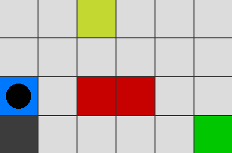

# Q-Learning from scratch
Implementation of reinforcement learning agent using Q-Learning for navigating a simple Gridworld / Frozen Lake environment, built without the use of external RL libraries.

## Aim
The aim of this project is to get my foot in the door of reinforcement learning by building a simple project from scratch, without the use of any RL libraries. More specifically, I want to understand how to use the Q-function to teach an agent to navigate a maze.

This fits into my broader learning approach for the field of Machine Learning, which is to:
1. Build several models completely from scratch to deeply understand the theory and math underlying them
2. Build on that knowledge by creating more complex projects where the focus shifts from raw implementation and theory to practical results for real-world problems.

## Demo
### Agent at the start

### Agent at the end


## Features
- Implementation of Q-Learning algorithm from scratch
- Adjustable hyperparameters and maze layout
- Visualization of agent's traversal through maze

## How It Works
The agent moves through the maze either randomly or by performing the action he assigns the highest value to. After each step, the value of performing that action on that field is updated using the Q-function.

## Google Colab
You can run this project using Google Colab instead of your local machine (Note that Pygame visualisations are not supported by Google Colab): 

[](https://colab.research.google.com/github/AntonNiko06/Q-Learning/blob/main/q_learning.ipynb)


## Local Installation
1. **Clone the repository**
```bash
git clone https://github.com/AntonNiko06/Q-Learning.git
cd Q-Learning
```
2. **Create virutal environment** (Optional)
```bash
python -m venv venv
```
```bash
source venv/bin/activate # On macOS/Linux
venv/Scripts/activate # On Windows
```
or
```bash
cd venv//Scripts
. activate
cd ..//..
```
3. **Install dependencies**
```bash
pip install -r requirements.txt
```

### Usage
Now you can simply execute the following command to run the script version of the project;
```bash
python q_learning.py
```
(You might have to select the Pygame window from the task bar if it's not opened already, as a final step)
